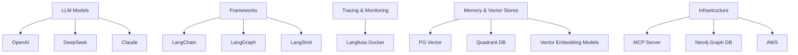

# 🤖 GenAI for Developers 🚀

  

## 📋 Course Overview

This comprehensive course provides a deep dive into **Large Language Models (LLMs)** and **Generative AI**, covering essential concepts, frameworks, and advanced applications. Participants will learn how to build AI-powered applications, optimize workflows, and implement security best practices in AI-driven systems.

> 💡 This is a practical, project-focused course that emphasizes building real applications with AI technology rather than theoretical mathematics.

## 🎯 What You Will Learn

| Category | Topics Covered |
|----------|----------------|
| **Fundamentals** | Introduction to LLM and Generative AI |
| **Agent Systems** | AI Agents, Agentic Workflows, Autonomous vs. Controlled Workflows |
| **Chat Applications** | Building Basic Chat Applications with LangChain, Chat Over Large Documents |
| **Advanced Techniques** | Retrieval-Augmented Generation (RAG), Context-Aware AI Applications |
| **Memory & Storage** | Memory-Aware AI Agents, Document-to-Graph DB and Embeddings |
| **Multi-Modal** | Multi-Modal LLM Applications (text, images, and other modalities) |
| **Security** | Security and Guardrails, Self-hosted models (Llama-3, Gemma) |
| **Orchestration** | AI Agent Orchestration with LangGraph, Checkpointing |
| **Human Integration** | Human-in-the-Loop Interruptions |
| **Integration** | Tool Binding and API Calling |
| **Infrastructure** | MCP Servers, Deployment on AWS |
| **Safety** | Guardrails for AI Models (prompt filtering, PII detection) |
| **Optimization** | Model Fine-Tuning, LLM as a Judge Technique |
| **Advanced APIs** | Perplexity Sonar API, Cypher Query Context Retrieval |

## 🛠️ Tech Stack

### 💻 Programming Language
- **Python**

### 🧠 LLM Models
- OpenAI
- DeepSeek
- Claude

### 🔄 Frameworks
- **LangChain** – A framework for building AI-powered applications
- **LangGraph** – A tool for structuring and managing AI agent workflows
- **LangSmit** – Enabling efficient AI development and execution

### 📊 Tracing & Monitoring
- **Langfuse** (Docker) – Self-hosted traces for AI applications

### 💾 Memory and Vector Stores
- **PG Vector** – A high-performance vector database
- **Quadrant DB** – A scalable, efficient vector store
- **Vector Embedding Models** – Enhancing AI understanding through embeddings

### ☁️ Infrastructure
- **MCP Server** – Managing AI inference and computation
- **Neo4j Graph DB** – Graph-based AI knowledge storage
- **AWS** – Scalable cloud deployment for AI applications

## 🎓 Learning Outcomes

By the end of this course, participants will gain expertise in:

| Category | Technologies |
|----------|--------------|
| **Frameworks** | LangChain, LangGraph, Hugging Face Transformers |
| **Databases** | Qdrant, Neo4j, Pinecone |
| **Models** | OpenAI, Gemini, Llama-3, Gemma |
| **Infrastructure** | AWS, Docker, LangSmit, Langfuse |

## 🏗️ Hands-On Projects

Participants will apply their knowledge by developing these real-world AI projects:

1. 📑 **AI-Powered Legal Document Assistant**  
   _Automating legal document processing and summarization_

2. 📊 **AI-Powered Chart Builder with Postgres**  
   _Generating interactive data visualizations using AI_

3. 📝 **AI-Powered Resume Roasting**  
   _Evaluating and improving resumes with AI-driven feedback_

4. 🔍 **AI-Powered Candidate Search**  
   _Enhancing recruitment with intelligent candidate matching_

5. 🌐 **AI-Powered Website Bot**  
   _Enabling AI-driven interactions with website content_

## 📈 Learning Path

```mermaid
graph LR
    A[Fundamentals] --> B[Basic Chat Applications]
    B --> C[Large Document Chat]
    C --> D[RAG Techniques]
    D --> E[Context-Aware Applications]
    E --> F[Memory Systems]
    F --> G[Multi-Modal Applications]
    G --> H[Security & Guardrails]
    H --> I[Agent Orchestration]
    I --> J[Advanced Integration]
    J --> K[Deployment]
```

> 💡 This course provides a hands-on approach, ensuring learners gain practical experience in building and deploying AI applications at scale.

---

  
  📞 Contact for more information | 🔗 [Course Website](https://example.com)

